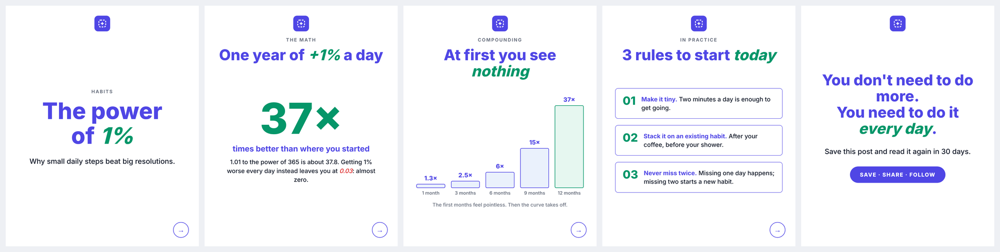
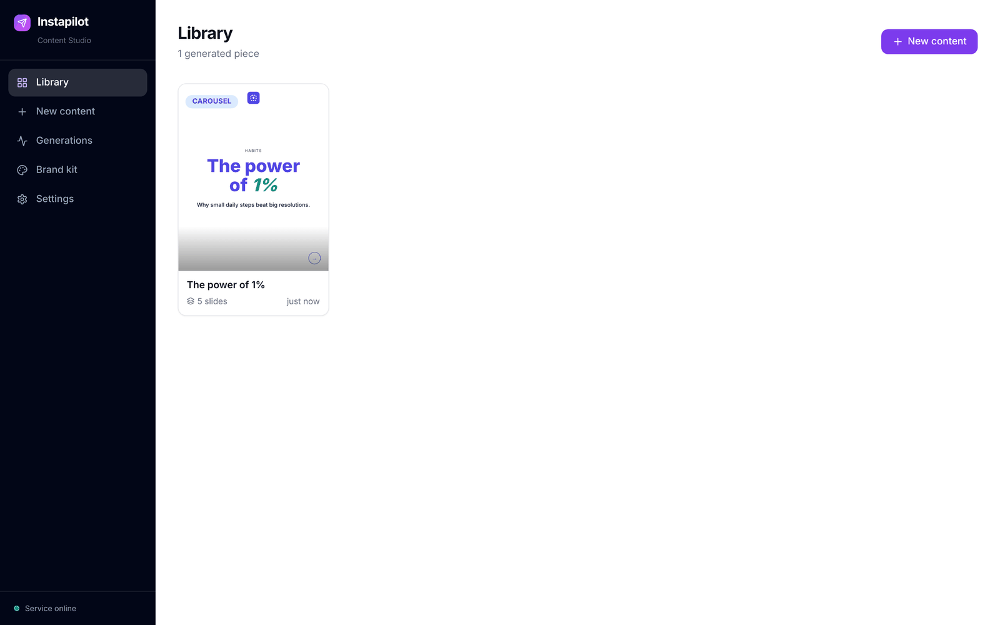
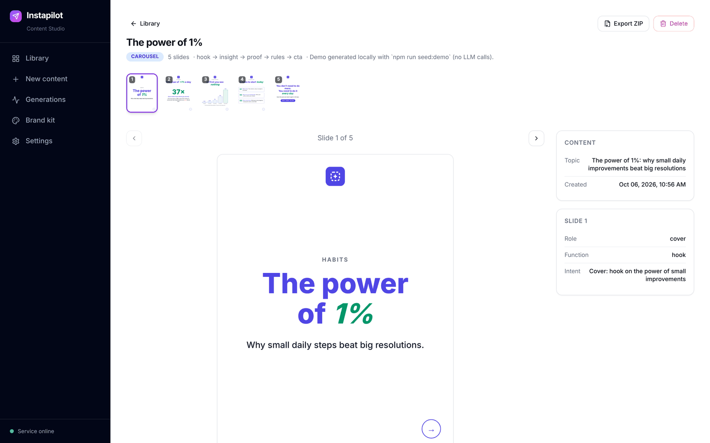
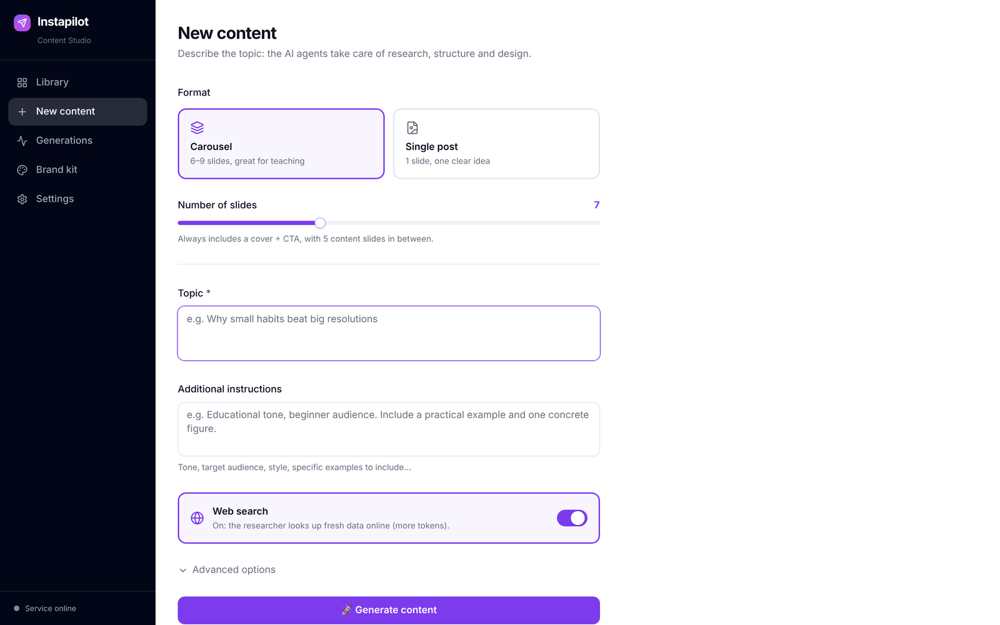
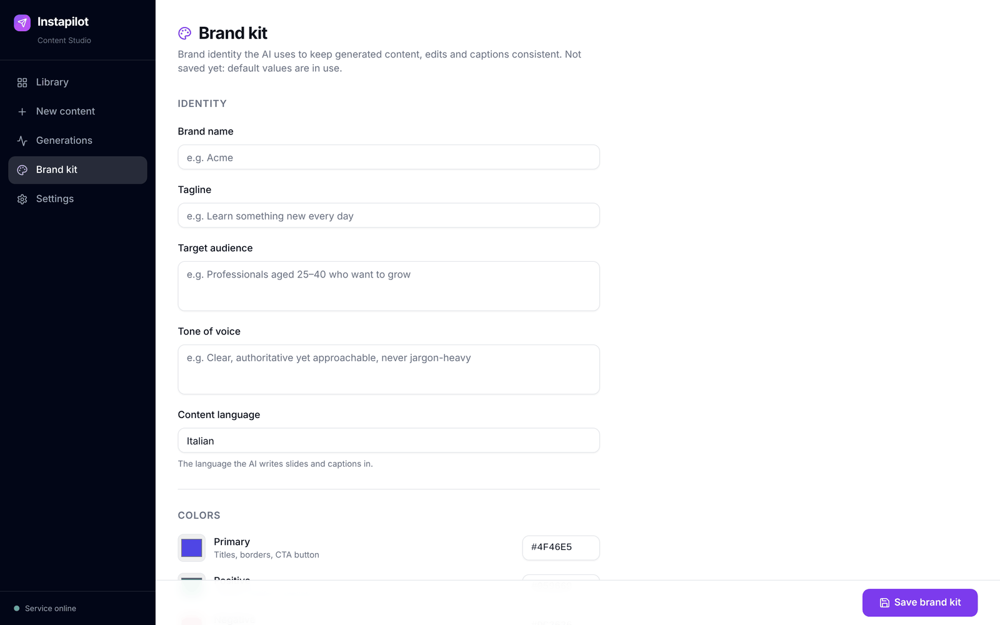
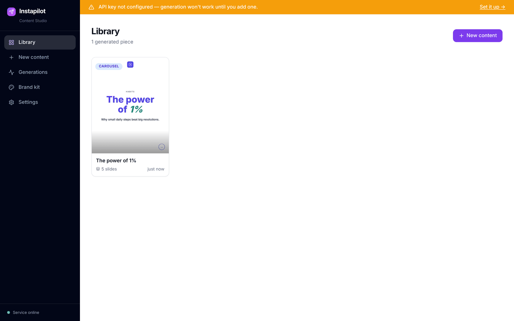

<div align="center">


# Instapilot

**From a topic to a ready-to-post Instagram carousel, in your brand.**

A pipeline of AI agents that researches, structures the narrative, designs every slide,
renders it to PNG and reviews it, all with your visual identity and your tone of voice.

[](LICENSE)




<sub>Example carousel rendered by the engine with the default Brand Kit (<code>npm run seed:demo</code>).</sub>

</div>

---

## Table of contents

- [Why Instapilot](#why-instapilot)
- [Features](#features)
- [Screenshots](#screenshots)
- [How it works](#how-it-works)
- [Quickstart](#quickstart)
- [Configuration](#configuration)
- [Customising the brand (white-label)](#customising-the-brand-white-label)
- [HTTP API](#http-api)
- [Project structure](#project-structure)
- [Development](#development)
- [Troubleshooting](#troubleshooting)
- [Contributing](#contributing)
- [License](#license)

---

## Why Instapilot

A good educational carousel takes hours: research, outline, copy, layout, visual consistency
across slides, proofreading. Generic "AI" tools produce text, not finished slides. Design tools
produce slides, but you still have to write the content yourself.

Instapilot covers the whole path, and does it **while respecting your brand**:

- **Content before graphics**: a researcher agent prepares a dossier (with optional web search),
  a planner turns it into a narrative arc (hook → development → payoff → CTA), a reviewer checks it.
- **Controlled design, not improvised**: every slide starts from a library of *layout recipes*
  (cover, lists, comparisons, KPIs, charts, flow diagrams…) and typography rules built for the feed.
- **Quality checked on the real render**: the slide is rendered in a headless browser,
  checked for overflow and collisions, then judged by an AI art director that looks at the PNG.
- **White-label by design**: no brand is hardcoded. Name, palette, font, logo, audience, tone
  and content language are configured from the UI and injected at runtime into every prompt and
  into the rendering.

## Features

| | |
|---|---|
| 🧠 **Multi-agent pipeline** | Research → review → plan → review → design → render → quality review → editorial review. |
| 🎠 **Carousels and single posts** | 6–9 slide carousels with visual consistency across slides, or a self-contained single post. |
| 🎨 **Brand Kit** | 6 colors with a semantic role, font, logo, tone, audience, content language, hashtags, CTAs, do's & don'ts. |
| 🌍 **Any content language** | Prompts are written in English; the generated copy follows the language set in the Brand Kit. |
| 🖥️ **Web Studio** | Content library, background generation with live progress, slide-by-slide detail view. |
| ✏️ **Editing** | Edit a slide's HTML or describe the change in plain language ("make the title shorter"), with history and revert. |
| ✍️ **Captions** | Caption + hashtags generated from the slides' content, in the brand's tone. |
| 📦 **Export** | ZIP with every slide as a PNG, ready to upload to Instagram. |
| 🔌 **Flexible provider** | OpenAI or any OpenAI-compatible endpoint (e.g. a LiteLLM proxy to Claude, Gemini, Llama…), with a configurable model per agent. |
| 💸 **Cost estimate** | Tokens and estimated cost for every generated piece. |
| 🧪 **Tested** | 230+ tests (unit + integration) with Vitest. |

## Screenshots

<table>
  <tr>
    <td width="50%"><br><sub><b>Library</b> — every generated piece, with a cover preview.</sub></td>
    <td width="50%"><br><sub><b>Detail</b> — slide navigation, metadata, editing, captions and export.</sub></td>
  </tr>
  <tr>
    <td width="50%"><br><sub><b>New content</b> — format, number of slides, topic, instructions, web search.</sub></td>
    <td width="50%"><br><sub><b>Brand kit</b> — identity, content language, semantic palette, font, logo and guidelines.</sub></td>
  </tr>
</table>

On first launch, until an API key is configured, the Studio points you to the Settings page with a banner:



## How it works

```mermaid
flowchart LR
    U([Topic + instructions]) --> R

    subgraph A["① Content"]
        R[Research<br/><sub>optional web search</sub>] --> RR{Dossier<br/>review}
        RR -- fixes --> R
        RR -- ok --> P[Narrative plan<br/><sub>arc + brief per slide</sub>]
        P --> PR{Plan<br/>review}
        PR -- fixes --> P
    end

    PR -- ok --> D

    subgraph B["② For each slide"]
        D[Design spec<br/><sub>recipe + hierarchy</sub>] --> DR{Design<br/>critic}
        DR -- reject --> D
        DR -- ok --> H[HTML + CSS]
        H --> V[Validation<br/><sub>security + brand rules</sub>]
        V --> X[Playwright render<br/><sub>1080×1350 PNG</sub>]
        X --> L[Layout audit<br/><sub>overflow, collisions</sub>]
        L --> Q{Quality review<br/><sub>vision on the PNG</sub>}
        Q -- fixes --> H
    end

    Q -- ok --> E{③ Editorial<br/>review<br/><sub>cross-slide coherence</sub>}
    E -- targeted fixes --> H
    E -- ok --> O[(Library<br/>PNG + HTML + manifest)]
```



**In short:**

1. **Content.** The *researcher* produces a dossier on the topic; a *reviewer* checks its accuracy
   and completeness. The *planner* picks a narrative framework and writes the brief for each slide;
   a second reviewer checks arc, density and repetition.
2. **Slides.** For each slide a *designer* picks the layout recipe and defines title, hierarchy and
   highlights; a *critic* approves it or sends it back. The *renderer* writes HTML+CSS that only uses
   the brand variables (`var(--brand-primary)`, `var(--brand-positive)`, …). The result is validated,
   wrapped in the brand "shell" (font, colors, logo, swipe arrow), rendered with headless Chromium and
   checked geometrically. Finally a multimodal *art director* looks at the PNG and asks for surgical
   fixes until the slide is publishable.
3. **Editorial review.** On carousels, a last agent rereads the whole sequence and applies targeted
   fixes to single slides without redoing their layout.

Every piece is saved in `output/<id>/` with the PNGs, the source HTML and a `manifest.json`
(plan, design specs, warnings, token usage).

> Besides the HTML pipeline, the project includes a rendering engine based on **Remotion**
> (React components + typed primitives) exposed by the `/render/still`, `/render/carousel` and
> `/render/dynamic` routes. See [HTTP API](#http-api).

## Quickstart

### Requirements

- **Node.js 20+** and npm
- An OpenAI **API key**, or an OpenAI-compatible endpoint (e.g. [LiteLLM](https://github.com/BerriAI/litellm))

### 1. Install

```bash
git clone https://github.com/CesareIsHere/instapilot.git
cd instapilot
npm install
npx playwright install chromium   # headless browser used for rendering
```

### 2. Run

```bash
npm run dev
```

Open **[http://localhost:3001](http://localhost:3001)**. The web Studio is prebuilt in `web/dist`
and served by the same server: no second process needed.

### 3. Connect the LLM provider

Go to **Settings**, paste the API key (and optionally base URL and model) and save.
The configuration stays local in `data/config.json`.

> Alternatively: `cp .env.example .env` and set `OPENAI_API_KEY=sk-...`.

### 4. Configure the brand

In **Brand kit** set name, audience, tone, **content language**, the 6 colors, the font, and upload the logo.

### 5. Generate

**New content** → write the topic → **Generate**. Follow the progress in
*Generations*; when the job finishes the piece shows up in the *Library*.

<details>
<summary><b>Want to explore the Studio without an API key?</b></summary>

```bash
npm run seed:demo
```

Adds a 5-slide demo carousel to the Library (the one at the top of this page). Its HTML is
hand-written, but it goes through the same shell and the same renderer as the pipeline, using **your**
current Brand Kit. It's a quick way to see how your palette, font and logo look. No LLM calls.

</details>

## Configuration

Most settings are managed from the UI. Environment variables are for deployments, automation or
advanced tuning: the full, commented list is in [`.env.example`](.env.example).

**Precedence:** settings saved from the UI → environment variables → defaults.

| Variable | Default | Description |
|---|---|---|
| `PORT` | `3001` | Server port (API + Studio). |
| `OPENAI_API_KEY` | — | OpenAI API key. |
| `OPENAI_MODEL` | `gpt-4o` | Default model for every agent. |
| `OPENAI_REASONING_EFFORT` | — | `minimal` \| `low` \| `medium` \| `high` for reasoning models. |
| `LITELLM_BASE_URL` / `LITELLM_API_KEY` / `LITELLM_MODEL` | — | OpenAI-compatible endpoint (takes priority over OpenAI). |
| `MODEL_<AGENT>` | `OPENAI_MODEL` | Model for a single agent: `RESEARCH`, `RESEARCH_REVIEW`, `PLAN`, `PLAN_REVIEW`, `DESIGN_PLAN`, `DESIGN_REVIEW`, `HTML_RENDER`, `QUALITY_REVIEW`, `EDITORIAL_REVIEW`, `DYNAMIC`. |
| `OPENAI_WEB_SEARCH_TOOL` | `web_search_preview` | Web-search tool used by the researcher. |
| `CONTENT_MAX_RESEARCH_ROUNDS` / `_PLAN_ROUNDS` / `_REVIEW_ROUNDS` | `2` | Max review rounds per phase. |
| `HTML_MAX_DESIGN_RETRIES` / `HTML_MAX_ATTEMPTS` | `3` / `5` | Max design and render attempts per slide. |
| `HTML_DEVICE_SCALE_FACTOR` | `1` | `1` = 1080×1350, `2` = 2160×2700. |
| `BRAND_CONTEXT_FILE` | `docs/brand-context.example.md` | Brand document used when no Brand Kit has been saved. |
| `BRAND_HANDLE` / `BRAND_DISCLAIMER` | `@yourbrand` / generic text | Footer of the Remotion slides. |
| `LLM_PRICE_INPUT_PER_1M` / `LLM_PRICE_OUTPUT_PER_1M` / `LLM_PRICE_CURRENCY` | `2.5` / `10` / `USD` | Prices used for the cost estimate. |
| `OUTPUT_DIR` | `./output` | Where generated content is saved. |

> **Cost tip:** the review agents (`*_REVIEW`) work well with smaller models too. For evergreen
> topics you can turn off web search from the form: it also skips the dossier review and cuts tokens
> noticeably.

## Customising the brand (white-label)

The code contains no brand. The identity comes in at runtime from **two layers**:

**1. Brand Kit** (UI → *Brand kit*, saved in `data/brand-kit.json`)

| Field | Effect |
|---|---|
| Name, tagline, audience, tone | Injected into the prompts of every agent (content, design, captions). |
| Content language | The language of all generated copy (slides, captions, edits). Default: `Italian`. Any language the model handles works, e.g. `English`, `Spanish`. |
| Colors `primary`, `positive`, `negative`, `paper`, `ink`, `muted` | Become the shell's CSS custom properties (`--brand-primary`, `--brand-positive`, `--danger`, `--paper`, `--ink`, `--muted`) and are documented with their real values in the design and review prompts. |
| Font | `Inter` (default), `Montserrat` and `Poppins` are bundled in `public/fonts/` (OFL license). You can add others as `Family-Regular.woff2`, `-Medium`, `-SemiBold`, `-Bold`, `-ExtraBold`. |
| Logo | Uploaded from the UI, placed in the slides through the `{{asset:logo}}` token. |
| Hashtags, CTAs, do's & don'ts, notes | Guide copy and captions. |

Colors have a **semantic role**, not a fixed value: titles use the primary color, the positive accent
highlights growth and favourable outcomes, the negative accent risks and losses. Changing the values
changes the look, without touching prompts or code.

**2. Brand context document** (fallback, or for headless pipelines)

A richer Markdown file: editorial pillars, compliance rules, things never to do.
Start from [`docs/brand-context.example.md`](docs/brand-context.example.md) (empty template) or from
[`examples/brand-contexts/productivity.md`](examples/brand-contexts/productivity.md) (filled-in example
for a fictional brand) and point `BRAND_CONTEXT_FILE` at your file.

## HTTP API

Everything the Studio does is available over REST, handy for integrations (n8n, Zapier, scripts).

<details>
<summary><b>Generation</b></summary>

| Method | Endpoint | Description |
|---|---|---|
| `POST` | `/api/generate` | Starts an asynchronous job (used by the Studio). |
| `GET` | `/api/generate` · `/api/generate/:id` | List jobs · status and progress of a job. |
| `POST` | `/api/generate/:id/retry` | Re-runs a job with the same parameters. |
| `POST` | `/generate/content` | **Synchronous** generation of a full carousel/post. |
| `POST` | `/render/html` | A single slide from a text prompt (HTML pipeline). |

```bash
curl -X POST http://localhost:3001/generate/content \
  -H 'Content-Type: application/json' \
  -d '{ "topic": "Why small habits beat big resolutions", "format": "carousel", "slideCount": 7 }'
```

</details>

<details>
<summary><b>Library</b></summary>

| Method | Endpoint | Description |
|---|---|---|
| `GET` | `/api/library` · `/api/library/:id` | List content · detail with slides. |
| `DELETE` | `/api/library/:id` | Delete a piece. |
| `GET` | `/api/library/:id/export` | ZIP with the slide PNGs. |
| `POST` | `/api/library/:id/caption` | Generate caption and hashtags. |
| `GET` · `PUT` | `/api/library/:id/slides/:n/html` | Read · save (and re-render) a slide's HTML. |
| `POST` | `/api/library/:id/slides/:n/ai-edit` | Edit a slide with a natural-language instruction. |
| `GET` · `POST` | `/api/library/:id/slides/:n/history` · `/revert` | History · restore a previous version. |

</details>

<details>
<summary><b>Configuration and brand</b></summary>

| Method | Endpoint | Description |
|---|---|---|
| `GET` · `PUT` | `/api/config` | LLM provider and models (the key is never returned, only its last 4 characters). |
| `GET` · `PUT` | `/api/brand` | Brand Kit. |
| `GET` · `POST` | `/api/brand/logo` | Current logo · upload a new logo. |
| `GET` | `/health` | Server status, Remotion bundle and API-key presence. |

</details>

<details>
<summary><b>Remotion engine</b></summary>

| Method | Endpoint | Description |
|---|---|---|
| `GET` | `/compositions` · `/primitives` · `/layouts` · `/theme` · `/assets` | Discovery: JSON schemas of primitives, layouts, theme tokens and assets. |
| `POST` | `/render/still` | One slide from a typed `SlideSpec` (see [`examples/example-slide.json`](examples/example-slide.json)). |
| `POST` | `/render/carousel` | Several slides in one call. |
| `POST` | `/render/dynamic` | Slide from a prompt: the LLM writes Remotion code compiled in a sandbox (see [`examples/dynamic-prompt.json`](examples/dynamic-prompt.json)). |

</details>

## Project structure

```
instapilot/
├── src/
│   ├── server/        # Express: API routes, async jobs, library, brand kit, uploads
│   ├── content/       # Content phase: research, narrative plan, reviews, orchestration
│   ├── html/          # Slide phase: design spec, recipes, prompts, HTML shell, Playwright render, audit, quality review
│   ├── llm/           # LLM client, captions, AI slide editing, Remotion prompt
│   ├── config/        # Persistence of the settings saved from the UI
│   ├── remotion/      # Remotion compositions and bundler
│   ├── primitives/    # Typed React components (Headline, RichText, Illustration, Footer)
│   ├── layouts/ chrome/ theme/ schema/ dynamic/ assets/ lib/
├── web/               # Studio: React + Vite + Tailwind (build committed in web/dist)
├── public/            # Fonts, placeholder logo, illustrations
├── examples/          # Example payloads and brand-context presets
├── scripts/           # seed:demo
├── docs/              # Brand-context template, technical notes, README assets
├── tests/             # unit, integration, snapshot (Vitest)
├── data/              # Local config and brand kit (gitignored)
└── output/            # Generated content (gitignored)
```

## Development

| Command | What it does |
|---|---|
| `npm run dev` | Server with hot reload on `:3001` (also serves the Studio from `web/dist`). |
| `npm run web:dev` | Studio in development with Vite on `:5173` (proxied to `:3001`). Run `npm install --prefix web` first. |
| `npm run web:build` | Rebuilds the Studio into `web/dist`. |
| `npm run seed:demo` | Adds the demo carousel to the Library. |
| `npm run studio` | Opens Remotion Studio on the compositions. |
| `npm run typecheck` | TypeScript type-check. |
| `npm test` | Runs the Vitest suite (`npm run test:watch` for watch mode). |

If you change anything in `web/src`, remember to run `npm run web:build` and commit `web/dist`:
that is what people who clone the repo get served.

## Troubleshooting

<details>
<summary><b>"Executable doesn't exist" / Chromium fails to launch</b></summary>

Playwright's browser is missing: run `npx playwright install chromium`
(on Linux you may also need `npx playwright install-deps chromium`).
</details>

<details>
<summary><b>The "API key not configured" banner doesn't go away</b></summary>

Save the key in **Settings**, or set `OPENAI_API_KEY` / `LITELLM_API_KEY` and restart the server.
The banner refreshes within a few seconds.
</details>

<details>
<summary><b>Slides use a different font from the one selected</b></summary>

The renderer works offline and only embeds the fonts found in `public/fonts/`
(or uploaded to `data/fonts/custom/`) named `Family-Weight.woff2`. If they are missing it falls back
to `sans-serif` and logs it (`html.fonts.missing`).
</details>

<details>
<summary><b>The Remotion routes (/render/still, /render/dynamic) download something on first run</b></summary>

Remotion downloads its own headless Chrome on the first render. In environments without internet
access it has to be pre-installed; the HTML pipeline (used by the Studio) relies on Playwright instead
and doesn't need it.
</details>

<details>
<summary><b>A generation fails or costs too much</b></summary>

Check the server logs (structured JSON on stdout) and the job detail in *Generations*.
Reduce the review rounds (`CONTENT_MAX_*`, `HTML_MAX_*`), use smaller models for the reviewers,
or turn off web search.
</details>

## Contributing

Issues and pull requests are welcome.

1. Fork and create a branch: `git checkout -b feat/my-change`
2. Keep the code brand-agnostic: no names, colors or assets of a specific brand in `src/`
   (use the Brand Kit and the `--brand-*` variables). Prompts are written in English; the output
   language comes from the Brand Kit.
3. Add or update tests and make sure `npm run typecheck && npm test` pass.
4. Open the PR explaining the *why* of the change.

## License

Released under the [MIT](LICENSE) license. The fonts bundled in `public/fonts/` are released under
the SIL Open Font License 1.1 (see the `OFL-*.txt` files).
