<div align="center">


# Instapilot

**Dall'argomento al carousel Instagram pronto da pubblicare, con il tuo brand.**

Una pipeline di agenti AI che fa ricerca, struttura la narrativa, progetta ogni slide,
la renderizza in PNG e la fa revisionare. Il tutto con la tua identità visiva e il tuo tono di voce.

[](LICENSE)


<sub>Carousel di esempio renderizzato dal motore con il Brand Kit di default (<code>npm run seed:demo</code>).</sub>

</div>

---

## Indice

- [Perché Instapilot](#perché-instapilot)
- [Funzionalità](#funzionalità)
- [Screenshot](#screenshot)
- [Come funziona](#come-funziona)
- [Quickstart](#quickstart)
- [Configurazione](#configurazione)
- [Personalizzare il brand (white-label)](#personalizzare-il-brand-white-label)
- [API HTTP](#api-http)
- [Struttura del progetto](#struttura-del-progetto)
- [Sviluppo](#sviluppo)
- [Troubleshooting](#troubleshooting)
- [Contribuire](#contribuire)
- [Licenza](#licenza)

---

## Perché Instapilot

Fare un buon carousel educativo richiede ore: ricerca, scaletta, copy, impaginazione,
coerenza grafica fra le slide, rilettura. Gli strumenti "AI" generici producono testo,
non slide finite. I tool di design producono slide, ma il contenuto lo devi scrivere tu.

Instapilot fa tutto il percorso, e lo fa **rispettando il tuo brand**:

- **Contenuto prima della grafica**: un agente ricercatore prepara un dossier (con ricerca web opzionale),
  un planner lo trasforma in un arco narrativo (hook → sviluppo → payoff → CTA), un revisore lo verifica.
- **Design controllato, non improvvisato**: ogni slide parte da una libreria di *layout recipe*
  (cover, liste, confronti, KPI, grafici, flow diagram…) e da regole tipografiche pensate per il feed.
- **Qualità verificata sul render reale**: la slide viene renderizzata in un browser headless,
  controllata per overflow e collisioni, poi giudicata da un art director AI che guarda il PNG.
- **White-label by design**: nessun brand cablato nel codice. Nome, palette, font, logo, pubblico e tono
  si configurano dalla UI e vengono iniettati a runtime in tutti i prompt e nel rendering.

## Funzionalità

| | |
|---|---|
| 🧠 **Pipeline multi-agente** | Ricerca → revisione → piano → revisione → design → render → quality review → revisione editoriale. |
| 🎠 **Carousel e post singoli** | Carousel da 6–9 slide con coerenza visiva fra le slide, oppure post singolo "self-contained". |
| 🎨 **Brand Kit** | 6 colori con ruolo semantico, font, logo, tono, pubblico, hashtag, CTA, do & don't. |
| 🖥️ **Studio web** | Libreria contenuti, generazione in background con avanzamento live, dettaglio slide per slide. |
| ✏️ **Editing** | Modifica dell'HTML di una slide o modifica in linguaggio naturale ("rendi il titolo più corto"), con cronologia e ripristino. |
| ✍️ **Caption** | Didascalia + hashtag generati dal contenuto delle slide, nel tono del brand. |
| 📦 **Export** | ZIP con tutte le slide PNG pronte da caricare su Instagram. |
| 🔌 **Provider flessibile** | OpenAI o qualsiasi endpoint OpenAI-compatibile (es. proxy LiteLLM verso Claude, Gemini, Llama…), con modello configurabile per singolo agente. |
| 💸 **Stima costi** | Token e costo stimato per ogni contenuto generato. |
| 🧪 **Testato** | Oltre 230 test (unit + integration) con Vitest. |

## Screenshot

<table>
  <tr>
    <td width="50%"><br><sub><b>Libreria</b> — tutti i contenuti generati, con anteprima della cover.</sub></td>
    <td width="50%"><br><sub><b>Dettaglio</b> — navigazione fra le slide, metadati, editing, caption ed export.</sub></td>
  </tr>
  <tr>
    <td width="50%"><br><sub><b>Nuovo contenuto</b> — formato, numero di slide, argomento, istruzioni, ricerca web.</sub></td>
    <td width="50%"><br><sub><b>Brand kit</b> — identità, palette semantica, font, logo e linee guida.</sub></td>
  </tr>
</table>

Al primo avvio, finché non configuri una API key, lo Studio ti guida con un banner verso le Impostazioni:


## Come funziona

```mermaid
flowchart LR
    U([Argomento + istruzioni]) --> R

    subgraph A["① Contenuto"]
        R[Ricerca<br/><sub>web search opzionale</sub>] --> RR{Review<br/>dossier}
        RR -- correzioni --> R
        RR -- ok --> P[Piano narrativo<br/><sub>arco + brief per slide</sub>]
        P --> PR{Review<br/>piano}
        PR -- correzioni --> P
    end

    PR -- ok --> D

    subgraph B["② Per ogni slide"]
        D[Design spec<br/><sub>recipe + gerarchia</sub>] --> DR{Design<br/>critic}
        DR -- rifiuta --> D
        DR -- ok --> H[HTML + CSS]
        H --> V[Validazione<br/><sub>sicurezza + regole brand</sub>]
        V --> X[Render Playwright<br/><sub>1080×1350 PNG</sub>]
        X --> L[Audit layout<br/><sub>overflow, collisioni</sub>]
        L --> Q{Quality review<br/><sub>visione sul PNG</sub>}
        Q -- correzioni --> H
    end

    Q -- ok --> E{③ Revisione<br/>editoriale<br/><sub>coerenza fra slide</sub>}
    E -- fix mirati --> H
    E -- ok --> O[(Libreria<br/>PNG + HTML + manifest)]
```



**In breve:**

1. **Contenuto.** Il *researcher* produce un dossier sull'argomento; un *reviewer* ne controlla accuratezza
   e completezza. Il *planner* sceglie un framework narrativo e scrive il brief di ogni slide; un secondo
   reviewer verifica arco, densità e ripetizioni.
2. **Slide.** Per ogni slide un *designer* sceglie la recipe di layout e definisce titolo, gerarchia ed
   evidenziazioni; un *critic* la approva o la rimanda indietro. Il *renderer* scrive HTML+CSS che usa
   solo le variabili del brand (`var(--brand-primary)`, `var(--brand-positive)`, …). Il risultato viene
   validato, inserito nella "shell" del brand (font, colori, logo, freccia swipe), renderizzato con
   Chromium headless e controllato geometricamente. Infine un *art director* multimodale guarda il PNG
   e chiede correzioni chirurgiche finché la slide non è pubblicabile.
3. **Revisione editoriale.** Sui carousel, un ultimo agente rilegge l'intera sequenza e applica fix
   mirati alle singole slide senza rifare il layout.

Ogni contenuto viene salvato in `output/<id>/` con PNG, HTML sorgente e un `manifest.json`
(piano, design spec, warning, consumo token).

> Oltre alla pipeline HTML, il progetto include un motore di rendering basato su **Remotion**
> (componenti React + primitive tipizzate) esposto dalle route `/render/still`, `/render/carousel`
> e `/render/dynamic`. Vedi [API HTTP](#api-http).

## Quickstart

### Requisiti

- **Node.js 20+** e npm
- Una **API key** OpenAI, oppure un endpoint OpenAI-compatibile (es. [LiteLLM](https://github.com/BerriAI/litellm))

### 1. Installa

```bash
git clone https://github.com/CesareIsHere/instapilot.git
cd instapilot
npm install
npx playwright install chromium   # browser headless usato per il rendering
```

### 2. Avvia

```bash
npm run dev
```

Apri **[http://localhost:3001](http://localhost:3001)**. Lo Studio web è già compilato in `web/dist`
e viene servito dallo stesso server: non serve un secondo processo.

### 3. Collega il provider LLM

Vai in **Impostazioni**, incolla la API key (ed eventualmente base URL e modello) e salva.
La configurazione resta in locale in `data/config.json`.

> In alternativa: `cp .env.example .env` e imposta `OPENAI_API_KEY=sk-...`.

### 4. Configura il brand

In **Brand kit** imposta nome, pubblico, tono, i 6 colori, il font e carica il logo.

### 5. Genera

**Nuovo contenuto** → scrivi l'argomento → **Genera**. Segui l'avanzamento in *Generazioni*;
a fine job il contenuto appare in *Libreria*.

<details>
<summary><b>Vuoi esplorare lo Studio senza API key?</b></summary>

```bash
npm run seed:demo
```

Crea in Libreria un carousel dimostrativo di 5 slide (quello in cima a questa pagina): l'HTML è scritto
a mano, ma passa per la stessa shell e lo stesso renderer della pipeline, usando il **tuo** Brand Kit
corrente. È un modo rapido per vedere come rendono palette, font e logo. Nessuna chiamata LLM.

</details>

## Configurazione

La maggior parte delle impostazioni si gestisce dalla UI. Le variabili d'ambiente servono per
deploy, automazioni o tuning avanzato: l'elenco completo e commentato è in [`.env.example`](.env.example).

**Precedenza:** impostazioni salvate dalla UI → variabili d'ambiente → default.

| Variabile | Default | Descrizione |
|---|---|---|
| `PORT` | `3001` | Porta del server (API + Studio). |
| `OPENAI_API_KEY` | — | API key OpenAI. |
| `OPENAI_MODEL` | `gpt-4o` | Modello di default per tutti gli agenti. |
| `OPENAI_REASONING_EFFORT` | — | `minimal` \| `low` \| `medium` \| `high` per i modelli di reasoning. |
| `LITELLM_BASE_URL` / `LITELLM_API_KEY` / `LITELLM_MODEL` | — | Endpoint OpenAI-compatibile (hanno priorità su OpenAI). |
| `MODEL_<AGENTE>` | `OPENAI_MODEL` | Modello per singolo agente: `RESEARCH`, `RESEARCH_REVIEW`, `PLAN`, `PLAN_REVIEW`, `DESIGN_PLAN`, `DESIGN_REVIEW`, `HTML_RENDER`, `QUALITY_REVIEW`, `EDITORIAL_REVIEW`, `DYNAMIC`. |
| `OPENAI_WEB_SEARCH_TOOL` | `web_search_preview` | Tool di ricerca web usato dal researcher. |
| `CONTENT_MAX_RESEARCH_ROUNDS` / `_PLAN_ROUNDS` / `_REVIEW_ROUNDS` | `2` | Giri massimi di revisione per fase. |
| `HTML_MAX_DESIGN_RETRIES` / `HTML_MAX_ATTEMPTS` | `3` / `5` | Tentativi massimi di design e di render per slide. |
| `HTML_DEVICE_SCALE_FACTOR` | `1` | `1` = 1080×1350, `2` = 2160×2700. |
| `BRAND_CONTEXT_FILE` | `docs/brand-context.example.md` | Documento brand usato se non c'è un Brand Kit salvato. |
| `BRAND_HANDLE` / `BRAND_DISCLAIMER` | `@yourbrand` / testo generico | Footer delle slide Remotion. |
| `LLM_PRICE_INPUT_PER_1M` / `LLM_PRICE_OUTPUT_PER_1M` / `LLM_PRICE_CURRENCY` | `2.5` / `10` / `USD` | Prezzi usati per la stima dei costi. |
| `OUTPUT_DIR` | `./output` | Dove vengono salvati i contenuti generati. |

> **Suggerimento sui costi:** gli agenti di revisione (`*_REVIEW`) funzionano bene anche con modelli
> più piccoli. Per argomenti "evergreen" puoi disattivare la ricerca web dal form: salta anche la
> revisione del dossier e riduce sensibilmente i token.

## Personalizzare il brand (white-label)

Il codice non contiene alcun brand. L'identità arriva a runtime da **due livelli**:

**1. Brand Kit** (UI → *Brand kit*, salvato in `data/brand-kit.json`)

| Campo | Effetto |
|---|---|
| Nome, tagline, pubblico, tono | Iniettati nei prompt di tutti gli agenti (contenuto, design, caption). |
| Colori `primary`, `positive`, `negative`, `paper`, `ink`, `muted` | Diventano le CSS custom property della shell (`--brand-primary`, `--brand-positive`, `--danger`, `--paper`, `--ink`, `--muted`) e sono documentati con i valori reali nei prompt di design e di review. |
| Font | `Inter` (default), `Montserrat`, `Poppins` inclusi in `public/fonts/` (licenza OFL). Puoi aggiungerne altri come `Famiglia-Regular.woff2`, `-Medium`, `-SemiBold`, `-Bold`, `-ExtraBold`. |
| Logo | Caricato dalla UI, inserito nelle slide tramite il token `{{asset:logo}}`. |
| Hashtag, CTA, do & don't, note | Guidano copy e caption. |

I colori hanno un **ruolo semantico**, non un valore fisso: i titoli usano il primario, l'accento
positivo evidenzia crescita ed esiti favorevoli, quello negativo rischi e perdite. Cambiando i valori
cambia l'aspetto, senza toccare prompt o codice.

**2. Documento di brand context** (fallback, o per pipeline headless)

Un file Markdown più ricco: pillar editoriali, regole di compliance, cose da non fare.
Parti da [`docs/brand-context.example.md`](docs/brand-context.example.md) (template vuoto) o da
[`examples/brand-contexts/productivity.md`](examples/brand-contexts/productivity.md) (esempio compilato
per un brand fittizio) e punta `BRAND_CONTEXT_FILE` al tuo file.

## API HTTP

Tutto ciò che fa lo Studio è disponibile via REST, utile per integrazioni (n8n, Zapier, script).

<details>
<summary><b>Generazione</b></summary>

| Metodo | Endpoint | Descrizione |
|---|---|---|
| `POST` | `/api/generate` | Avvia un job asincrono (usato dallo Studio). |
| `GET` | `/api/generate` · `/api/generate/:id` | Elenco job · stato e avanzamento di un job. |
| `POST` | `/api/generate/:id/retry` | Rilancia un job con gli stessi parametri. |
| `POST` | `/generate/content` | Generazione **sincrona** di un carousel/post completo. |
| `POST` | `/render/html` | Una singola slide da prompt testuale (pipeline HTML). |

```bash
curl -X POST http://localhost:3001/generate/content \
  -H 'Content-Type: application/json' \
  -d '{ "topic": "Perché le abitudini piccole battono i grandi propositi", "format": "carousel", "slideCount": 7 }'
```

</details>

<details>
<summary><b>Libreria</b></summary>

| Metodo | Endpoint | Descrizione |
|---|---|---|
| `GET` | `/api/library` · `/api/library/:id` | Elenco contenuti · dettaglio con slide. |
| `DELETE` | `/api/library/:id` | Elimina un contenuto. |
| `GET` | `/api/library/:id/export` | ZIP con le slide PNG. |
| `POST` | `/api/library/:id/caption` | Genera caption e hashtag. |
| `GET` · `PUT` | `/api/library/:id/slides/:n/html` | Legge · salva (e ri-renderizza) l'HTML di una slide. |
| `POST` | `/api/library/:id/slides/:n/ai-edit` | Modifica una slide con un'istruzione in linguaggio naturale. |
| `GET` · `POST` | `/api/library/:id/slides/:n/history` · `/revert` | Cronologia · ripristino di una versione precedente. |

</details>

<details>
<summary><b>Configurazione e brand</b></summary>

| Metodo | Endpoint | Descrizione |
|---|---|---|
| `GET` · `PUT` | `/api/config` | Provider LLM e modelli (la key non viene mai restituita, solo le ultime 4 cifre). |
| `GET` · `PUT` | `/api/brand` | Brand Kit. |
| `GET` · `POST` | `/api/brand/logo` | Logo corrente · upload nuovo logo. |
| `GET` | `/health` | Stato del server, bundle Remotion e presenza della API key. |

</details>

<details>
<summary><b>Motore Remotion</b></summary>

| Metodo | Endpoint | Descrizione |
|---|---|---|
| `GET` | `/compositions` · `/primitives` · `/layouts` · `/theme` · `/assets` | Discovery: schemi JSON di primitive, layout, token del tema e asset. |
| `POST` | `/render/still` | Una slide da `SlideSpec` tipizzato (vedi [`examples/example-slide.json`](examples/example-slide.json)). |
| `POST` | `/render/carousel` | Più slide in una chiamata. |
| `POST` | `/render/dynamic` | Slide da prompt: l'LLM scrive codice Remotion compilato in sandbox (vedi [`examples/dynamic-prompt.json`](examples/dynamic-prompt.json)). |

</details>

## Struttura del progetto

```
instapilot/
├── src/
│   ├── server/        # Express: route API, job asincroni, libreria, brand kit, upload
│   ├── content/       # Fase contenuto: ricerca, piano narrativo, revisioni, orchestrazione
│   ├── html/          # Fase slide: design spec, recipe, prompt, shell HTML, render Playwright, audit, quality review
│   ├── llm/           # Client LLM, caption, editing AI delle slide, prompt Remotion
│   ├── config/        # Persistenza della configurazione salvata dalla UI
│   ├── remotion/      # Composition e bundler Remotion
│   ├── primitives/    # Componenti React tipizzati (Headline, RichText, Illustration, Footer)
│   ├── layouts/ chrome/ theme/ schema/ dynamic/ assets/ lib/
├── web/               # Studio: React + Vite + Tailwind (build committata in web/dist)
├── public/            # Font, logo placeholder, illustrazioni
├── examples/          # Payload di esempio e preset di brand context
├── scripts/           # seed:demo
├── docs/              # Template brand context, note tecniche, asset del README
├── tests/             # unit, integration, snapshot (Vitest)
├── data/              # Config e brand kit locali (gitignored)
└── output/            # Contenuti generati (gitignored)
```

## Sviluppo

| Comando | Cosa fa |
|---|---|
| `npm run dev` | Server con hot reload su `:3001` (serve anche lo Studio da `web/dist`). |
| `npm run web:dev` | Studio in sviluppo con Vite su `:5173` (proxy verso `:3001`). Esegui prima `npm install --prefix web`. |
| `npm run web:build` | Ricompila lo Studio in `web/dist`. |
| `npm run seed:demo` | Crea il carousel dimostrativo in Libreria. |
| `npm run studio` | Apre Remotion Studio sulle composition. |
| `npm run typecheck` | Type-check TypeScript. |
| `npm test` | Esegue la suite Vitest (`npm run test:watch` in watch mode). |

Se modifichi qualcosa in `web/src`, ricordati di eseguire `npm run web:build` e committare `web/dist`:
è ciò che viene servito a chi clona il repo.

## Troubleshooting

<details>
<summary><b>"Executable doesn't exist" / errore all'avvio di Chromium</b></summary>

Manca il browser di Playwright: esegui `npx playwright install chromium`
(su Linux eventualmente `npx playwright install-deps chromium`).
</details>

<details>
<summary><b>Il banner "API key non configurata" non sparisce</b></summary>

Salva la key in **Impostazioni** oppure imposta `OPENAI_API_KEY` / `LITELLM_API_KEY` e riavvia il server.
Il banner si aggiorna entro pochi secondi.
</details>

<details>
<summary><b>Le slide usano un font diverso da quello scelto</b></summary>

Il renderer funziona offline e incorpora solo i font presenti in `public/fonts/`
(o caricati in `data/fonts/custom/`) con la convenzione `Famiglia-Peso.woff2`. Se mancano, ripiega su
`sans-serif` e lo segnala nei log (`html.fonts.missing`).
</details>

<details>
<summary><b>Le route Remotion (/render/still, /render/dynamic) scaricano qualcosa al primo avvio</b></summary>

Remotion scarica il proprio Chrome headless al primo render. In ambienti senza accesso a internet
serve pre-installarlo; la pipeline HTML (usata dallo Studio) usa invece Playwright e non ne ha bisogno.
</details>

<details>
<summary><b>Una generazione fallisce o costa troppo</b></summary>

Controlla i log del server (JSON strutturato su stdout) e il dettaglio del job in *Generazioni*.
Riduci i giri di revisione (`CONTENT_MAX_*`, `HTML_MAX_*`), usa modelli più piccoli per i reviewer
o disattiva la ricerca web.
</details>

## Contribuire

Issue e pull request sono benvenute.

1. Fai un fork e crea un branch: `git checkout -b feat/la-mia-modifica`
2. Mantieni il codice brand-agnostic: niente nomi, colori o asset di un brand specifico in `src/`
   (usa il Brand Kit e le variabili `--brand-*`).
3. Aggiungi o aggiorna i test e verifica che `npm run typecheck && npm test` passino.
4. Apri la PR descrivendo il *perché* della modifica.

## Licenza

Distribuito con licenza [MIT](LICENSE). I font inclusi in `public/fonts/` sono distribuiti con
SIL Open Font License 1.1 (vedi i file `OFL-*.txt`).
